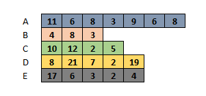

```{r setup, include=FALSE}
knitr::opts_chunk$set(echo = TRUE)

if (!requireNamespace(pck <- 'babynames'))
  install.packages(pck)
```

# Theoretical Background

## Functions (Overview)

The structure of a function created in R is of the form

    fnname(formals) { body }

and they are created by the assignment

    name <- function(param1, param2, ...)

and called thus

    name(arg1, arg2)

A function definition creates a function object, while a function call first captures arguments from the environment (if any) and then executes the code inside the function body.

One can think of a function as a block of R code attached together with a name and some arguments in a list. Indeed, this is how most R functions are structured internally.

For example,

```{r}
## Function definition
addTwo <- function(x) {
  x + 2
}

num <- 40L

## Function call
result <- addTwo(x = num)
result
```

Note that a function is only created after the function definition is executed.

## Note on Scoping

We said that a function can capture its values from its enclosing environment i.e. the environment of the caller.

```{r}
# Let's redefine addTwo
addTwoScoped <- function() {
  x + 2
}

x <- 10L
addTwoScoped()
```

In the construct above, `addTwoScoped` could not find an object named `x` within the function environment, so by the rules of lexical scoping, it searches for the symbol in the parent environment (i.e. the caller's environment).

Remember the discussion on the search path, along which packages are attached and how R searches for a function along that path. The mechanism here is the same and this is a fundamental aspect of R. This mechanism is powered by another data structure called **environments**. Environments are beyond the scope of this course and are not essential knowledge for day-to-day data analysis in R; they are of more interest in package development.

There are other characteristics of R functions like [**lazy evaluation**](https://en.wikipedia.org/wiki/Lazy_evaluation), but we will skip those for now.

## Functional programming

In functional programming a program is constructed by applying and composing functions. Simplistically, it enables us to program with functions in a way that they are more than just sub-routines.

Functional programming has its roots in mathematics and is thus very suitable for statistical programming. This makes it easy to treat them as mathematical functions, especially pure functions (treated below).

### First-class functions

R characteristically has what we know as *first-class functions* such that they can be created, used and managed in the same manner as variables. This means that functions in R can be:

-   Bound to names
-   Passed as arguments
-   Combined/collected in containers i.e. lists
-   Returned from functions i.e. factories

In R, **functions are objects**! The function `function()` is actually a constructor for a type of function object known as a closure.

### Pure functions

Pure functions are, simply put, those whose output is predictable by their input. As such they do not have side effects and are not influenced by any extraneous factors. An example of pure functions are mathematical functions. These functions are self-contained and seemingly *have a life of their own*.

```{r}
pure <- function(a, b) {
  a^b
}

pure(3, 2)
pure(3, 3)
```

Once the definition of a pure function is known, its output should be predictable based on its arguments, if any.

### Impure functions

Impure functions have side effects e.g. downloading a file, or are influenced by various states e.g. by variables in the caller's environment. Impure functions are as important, especially in practical data analysis tasks.

```{r}
impure <- function(x, file) {
  stopifnot(is.atomic(x))
  writeLines(x, file)
}

impure(letters, 'file.txt')
file.show('file.txt')
```

```{r, include=FALSE}
file.remove('file.txt')
```

## Functionals

Functionals are functions that receive another function as an argument and return a vector as output. This function is mapped to a data structure and applied to each of its elements. For an atomic vector, this means each individual base type element; for a data frame, this would be each column.

An alternative to using a functional would be to use an iterative mechanism such as a for-loop.

## Motivation

Data analysis often involves carrying out an operation repeatedly across a set of data points. Functionals make this process easier - complex computations can be broken down into smaller, modular steps. Each of these steps can then be run individually across the data, and then the end result put together as the final output.

## The 'Apply' Family of Functions

These are a set of functions that apply another function along the length of a vector. And by vector, we are not referring just to **atomic** vectors. A list is a vector and since a data frame is a list, it means that it too is a vector. Matrices are said to have 2 dimensions. Well, in actual fact, they are atomic vectors (can only be of one base type) but have an attribute `dim` that is set to `2`. So, our use of vocabulary is governed by what we are trying to do with our objects. For functionals, it is helpful to have a mental model where everything is uni-dimensional.

### `apply`

This function will apply a function to an object `x` with the property `length(dim(x)) == 2L`. It has the following signature,

```{r}
args(apply)
```

and its arguments are as follows:

| Arg      | Description              |
|----------|--------------------------|
| X        | The object               |
| MARGIN   | 1 for row; 2 for column  |
| FUN      | Applied function's name  |
| ...      | Additional args to `FUN` |
| simplify |                          |

To exemplify this function, we will create a 1000 X 10 matrix i.e. 10,000 data points.

```{r}
# One way to create a matrix that highlights it's internal structure as an atomic vector
x <- sample(c(1:10, NA_integer_), size = 10000, replace = TRUE)
dim(x) <- c(1000, 10)
colnames(x) <- LETTERS[seq_len(ncol(x))]
head(x, n = 10)
```

Now, we will apply the function `median` in a row-wise manner to the matrix `x`.

```{r}
rowMedian <- apply(x, 1, median)
head(rowMedian)
```

We now map the function to the matrix in a column-wise manner:

```{r}
colMedian <- apply(x, 2, median)
colMedian
```

We see the median is not computed for **all the columns** and we can deduce that there is no column that does not have `NA`s. Recalling a previous lesson, we can tweak functions like `median` by telling them not to include the missing values in the computation. For the functional `apply`, this is where the `...` (dot-dot-dot or *ellipsis*) parameter comes in.

```{r, results='asis'}
rowMedian <- apply(x, 1, median, na.rm = TRUE)
head(rowMedian)
```

```{r}
(colMedian <- apply(x, 2, median, na.rm = TRUE))

```

The length of `rowMedian` confirms that it is the median computed down the *height* of our matrix

```{r}
length(rowMedian)
```

#### Custom functions and lambdas

Often, we want to carry out an operation on an object but there is no pre-existing function (or we don't know of its existence). The solution is just to develop the function by ourselves. This is user-defined is created with the `function()` constructor, as shown above. If we name the functions, we can apply that function using its name, just as we did with `median` in the previous example. However, sometimes the function is not worth defining with a new name: R allows us to apply an **anonymous function** *in situ*. We can create an example by asking the question: How many missing values are there in each column of `x`? The function `is.na` will return a logical vector with `TRUE` for the element that is missing and `FALSE` otherwise. Then, the function `sum` will count how many values are `TRUE` in a given vector. Putting it all together, we have

```{r}
numberMissing <- apply(x, 2, function(col) sum(is.na(col)))
numberMissing
```

### `lapply`

This is the next major and most commonly used functional during data analysis. It takes a uni-dimensional object as the object that a function will be applied to i.e. there is no question of margins here. Its signature is simple

```{r}
args(lapply)
```

This function always returns a list and this means it can accommodate a variety of objects as output. This why it is quite popular in data analysis. For example, we can apply a modelling function on different datasets and very easily collect all the outputs in one data structure. However, because it always returns a list it can be difficult to manage when we want simpler results e.g. an atomic vector. Using `lapply` to compute the median of our matrix `x` won't make sense

```{r}
length(lapply(x, median))
```

But if we turn it into a data frame, it can be donw.

```{r}
x
lapply(as.data.frame(x), median, na.rm = TRUE)
```

We have a similar result to `apply` except that the elements are in a list. To change this to a vector, you can use the function `unlist`. Note that once we converted the matrix into a data frame, each column was taken as an element and the function `median` was applied to it. The `names` of the list confirms this.

### `sapply`

This is a wrapper function of `lapply` that enables us to simplify the results, particularly when we desire to have a vector as our output. So, using the last example

```{r}
sapply(as.data.frame(x), median, na.rm = TRUE)
```

From its signature

```{r, echo=FALSE}
args(sapply)
```

we can see the default values for `simplify` and `USE.NAMES` and how they impacted the result. The user can tweak this as desired.

### `tapply`

This is another useful member of this group of functions. It is extremely useful in applying a function across a ragged array, which is a collection of grouped items that may not necessarily be of the same length. A ragged array in R is just a list with vectors of the same type that have different lengths. This can be pictured as groups and the grouping variable would be a factor (or something coercible into one). Thus

```{r}
set.seed(1)
vec <- 
  c(11, 10, 17, 8, 6, 21, 7, 6, 3, 8, 3, 9, 2, 12, 4, 2, 8, 2, 5, 3, 19, 6, 4, 8)
fac <- sample(LETTERS[1:5], size = length(vec), replace = TRUE, prob = c(.292, .167, .208, .125, .208))
head(data.frame(vector = vec, group = fac))
```



Given that the

```{r}
tapply(fac, vec, median)
```

### `vapply`

This functional works just like `sapply` in that it returns a vector, but it requires that the type of the return value is specified by the programmer. This function is not used much in data analysis, but is safer to use inside functions are defined. This is to prevent unexpected results that can occur with the use of other functions.

```{r}
vapply(as.data.frame(x), median, numeric(1), na.rm = TRUE)
```

For the function `median` when applied to the data frame is expected to return a numeric vector or length 1. The argument `FUN.VALUE` is where we set the expected return value, which has to be correct and exact, otherwise the function will fail. If we try to set the return value with the wrong type or size, e.g. with

```{r}
numeric(2)
```

we have an error

```{r, error=TRUE}
vapply(as.data.frame(x), median, numeric(2), na.rm = TRUE)
```

One way to use this function is to provide a sample function value, which will have the same effect. This is useful when programming, when you don't have to know the exact type or size before hand, but can determine it based on the state of the function at that given time.

```{r}
df <- as.data.frame(x)
vapply(df, is.na, logical(nrow(df)))  # we obtain the size from the data
```

We could even go a step further to name the return value

```{r}
height <- nrow(df)
babies <- sample(babynames::babynames$name, height)
named <- structure(logical(height), names = babies)
y <-vapply(df, is.na, named)
head(y, 20)
```

### `mapply`

It is possible to map a function to more than one vector at a time and that is the work of `mapply`. For instance, `fac` and `vec` mentioned earlier can be pasted together by applying the `paste` function to both vectors using `mapply`.

First, we try it out with only single elements

```{r}
# paste0() glues together to strings without any intervening space
# Note that implicit coercion is at work here!
paste0("A", 11)
```

Now, we apply this function to both vectors, `mapply` makes it possible for the function to execute on both vectors, element-by-element.

```{r}
mapply(paste0, fac, vec, USE.NAMES = FALSE)
```

Note that for a function like `mapply` to work correctly, the

**Caveat**: This is just an example to demonstrate how to use `mapply`. In reality, `paste0` is vectorized and thus it is easier to carry out the same operation viz

```{r}
paste0(fac, vec)
```

`mapply` is well suited for use with more complex data structures and with user-defined functions.

```{r}
?Map
```

<!-- ## Higher-Order Functionals -->

<!-- ### Map-Reduce -->

<!-- ### Filtering -->

<!-- ### Search -->

## The 'purrr' package

This is a popular third-party package that significantly make functional programming easier. The main function in the package is called `map` which is just like `lapply` in returning a list.

```{r}
library(purrr)
map(df, median, na.rm = TRUE)
```

Now, there are variants of `map` that will allow us to both simplify the result and specify the type of output we want.

| Function  | Value     |
|-----------|-----------|
| `map_chr` | character |
| `map_dbl` | double    |
| `map_int` | integer   |
| `map_lgl` | logical   |

```{r}
map_dbl(df, median, na.rm = TRUE)
```

There are other functions that enable us to return data frames, combining the elements by row or by column (`map_dfr` and `map_dfc`, respectively)

```{r}
result <- map_dfc(df, is.na)
is.data.frame(result)
result
```

There are many more possibilities with the purrr package - for additional information see [Chapter 21 of R for Data Science](https://r4ds.had.co.nz/iteration.html)

## To Loop or Not To Loop?

When reasoning about how to iterate over one or more data structures, the option of using loops remains. The rule of thumb is to revert to loops if working with functionals is too complicated.

One of the times when using a loop might be preferable is when trying to modify an object **in place** e.g. changing names of a data frame where we are assigning new values with `<-`.

```{r}
# Create a data frame and check its names
mydata <- data.frame(food = runif(10), bar = runif(10), baz = runif(10))
colnames(mydata)

# Write a loop
# During each iteration, do the following:
# - Check the number of characters in a given name
# - If it's greater than 3, shorten it to 3
# - Replace the column name at that position with the shortened version
for (i in seq_along(mydata)) {
  nm <- colnames(mydata)[i]
  len <- nchar(nm)
  if (len > 3L)
    colnames(mydata)[i] <- substr(nm, 0, 3)  # substr cuts it from position 0 to 3
}

# Check the new names
colnames(mydata)
```

# Conclusion

We have looked at how functional programming is done in R and how it can help apply functions (both pre-defined and custom-made) to quickly carry out operations across any data structure.

We also introduced the *purrr* package which provides a very handy toolkit for functional programming in R.
