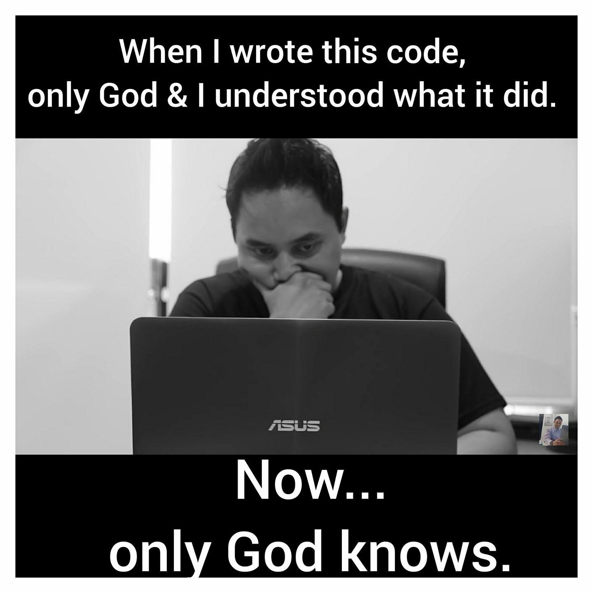

```{r setup, include=FALSE}
knitr::opts_chunk$set(echo = TRUE)
```

# Installation & Use

## Invoking R - interactive
- R Console
- Read-Eval-Print Loop
- The Prompt
    + By default... **`>`**
    + Continuation... **`+`**

## Invoking R - non-interactive
>- R code can be run in batch mode i.e. non-interactively.
>- Instruction are saved in a text file known as a script.
>- File extension `.R` or `.r`.
>- Script is read line by line from top to bottom.
>- Each line is read from left to right.
>- This is how R code is shared, including that in packages.
>- Can be written with any text editor e.g. Notepad.

## Quick Demo

# R Syntax

## Constants
>- These are 'scalar' quantities that are sent to the R interpreter
>- Usually these scalars are numeric data like integers or doubles, booleans (`TRUE`/`FALSE`),
>- When used like this, they are returned as-is.

--- 

```{r constants}
26L

2.71828

0xef

"Hello"

NULL
```

---

Some other special constants that one may come across in mathematical computations

- Inf, -Inf
- NaN

```{r inf-nan, results="hold"}
1/0
0/0
```

## How R code is parsed
>- R instructions are called statements
>- Statements are always executed one at a time.
>- It is possible to have 2 or more statements on a single line, separated by a semicolon (`;`).
>- If a statement cannot be successfully evaluated, an **ERROR** is thrown and execution terminated. The REPL is returned to the prompt, ready to receive new input.
>- Sometimes, a problematic operation can be signalled by a **WARNING** - code executes successfully but notice is given after the fact.

---

```{r, error=TRUE}
1 + 1
6 / 4
1 + 1; 6 / 4  # identical 
1 + "a"
```


## Character strings
>- Bounded by double quotes
>- Created using single or double quotes
>- Use of escapes with the backslash (`\`) for nested quotes and special characters.

---

```{r, error=TRUE}
"He said: "I have a dream""
```

```{r escapes}
"He said: \"I have a dream!\""
"The right word is 'cute'."
```

## Naming data (variables)

>- Objects created in R can be bound to symbols
>- These named objects are *variables*
>- When the name is read and evaluated, the object's value is printed by R.
>- The operation that binds a name to an object is called __*assignment*__.
>- `<-` is the assignment operator.
    + `=` works as well

---

```{r assign}
## Create a variable
life <- 42L

## Evaluate the variable by printing out its value
life
```

## Symbols (or Names)
Rules:

- Can contain any alphanumeric character, dot (`.`) or underscore (`_`)
- Cannot **start** with `_`
- Cannot start with number
- Cannot contain special characters other than e.g. `+`, `-`, `?`, etc
- Cannot contain whitespace
- Can be overridden by surrounding with backticks _**`**_

---

```{r naming-rules, eval=FALSE}
myobject <- "a"

my.object <- TRUE

.myObject <- 1e-12

_myObject <- 6.3328   # illegal
4myobject <- 6798L    # illegal

`4myobject` <- 6798L  # backquotes make this permissible
```

- R code is case sensitive - `sum` is different from `Sum`

---

<center>

**Quiz**  

**How can you tell between a symbol and a character string?**
</center>

## Functions and operators
> - Everything that does something in R is a function
> - Either return a value or have side effects.
> - Functions in R are held in packages.
> - R comes with default packages that are made available during each R session
> - For the contents of a package to be accessible, it must be attached to the search path.
> - When a function is called, R searches for it in the attached packages.
> - The `base` package is the most important packages that is ALWAYS available.
> - Other packages that are usually attached by default are `utils`, `stats`, `methods`, `graphics`, `grDevices`, `datasets`
> - Between these packages, we have some **`r prettyNum(sum(purrr::map_dbl(grep("package", search(), value = TRUE), ~ length(ls(name = .x)))), ",")`** objects.

## Types of operators
- Arithmetic
    + `+`,   `-`,   `*`,   `/`
    + `^`,   `%%`,   `%/%` (exponentiation, modulo, integer division)
- Logical
    + `&`,   `|`,   `!`
- Comparison
    + `==`,   `!=`
    + `<`,  `>`, `<=`, `>=`
    
---

**Arithmetic**

```{r arithmetic}
4^3
7 / 5
7 %% 5
7 %/% 5
```

---

**Logical**

```{r logical}
TRUE & FALSE
TRUE | FALSE
!FALSE
!TRUE
```


---

**Comparison**

```{r comparison}
x <- 7L
x == 7
x != 7
x < 8
x > 7
x >= 7
x <= 3

```

    
## Function calls
To use a function in R:

- Write its name with open and closing parentheses e.g. `()`
- Write its arguments, if any, within the parentheses 
- Run i.e. evaluate the function

---

```{r, eval=FALSE}
func(arg1, arg2)                     # 1. signature

func(arg1 = "input1", arg2 = 4.333)  # 2. function call

func("input1", 4.333)                # 3. Same as 2

func(arg2 = 4.333, arg1 = "input1")  # 4. Same as 2 & 3

func(4.333, "input1")                # 5. Likely to fail
```


## Comments
> - Any code, whether in full or in part, that is started with a pound (`#`) sign.
> - Such portions of code are ignored by the R interpreter
> - An important part of coding - in any language
> - Used to describe what the code is doing and expantiate on constructs used.
> - Vital for fellow programmers to interact with code, as well as "future self".

---

```{r}
# This is a comment - the whole line will be ignored
"This is a valid string; it will be evaluated" # but this part won't
```

---

<center>
**Comments are important!**
{width=75%}
</center>


# The R session

## Key concepts
- The working directory
- The Workspace
- The search path
    
## Working Directory

```{r wd, eval=FALSE}
getwd()              # Displays the current working directory

setwd("path/to/dir") # Sets working directory to a new location

list.files()         # Lists contents of directory, defaults to getwd()
```

## Workspace
>- Also known as the global environment
>- Names of objects created by session are bound here
>- Chained to attached packages so their contents are accessible

--- 

```{r cleanup, include=FALSE}
rm(list = ls())
```

```{r globalenv}
ls()
x <- 1e7
ls()
rm(x)    # appropriate arguments to remove multiple objects
ls()
```

## Search path
- Using 3rd party packages
    + Installing packages (`install.packages()`)
    + Attaching or loading packages (`library()` and `::` operator)
- The search path
    + `base` package first, then other default packages.
    + Additional package(s) attached by user/code
    
---

```{r searchp}
search()

library(MASS)

search()
```

# Accessing Resources
## Documentation and help
- Your R installation comes with a rich set of documentation and help files.
- Every R package has its own set of help files.
- Function documentation can be read offline with `?` operator.
- Also use online resources:
    + Web search
    + StackOverflow
    + Social media, notably Twitter ([#rstats](https://twitter.com/search?q=%23rstats)) and Reddit

---

R Manuals

```{r nanual, eval=FALSE}
help.start()           # Opens R Manuals (best for reference purpose)
```

---

Function help

```{r, eval=FALSE}
?sum

help("sum")            # Help for the function 'sum'
```

--- 

Package documentation

```{r package-help, eval=FALSE}
help(package = "MASS") # Help on the MASS package

library(help = "MASS") # Summary info on the MASS package
```

# Questions?
