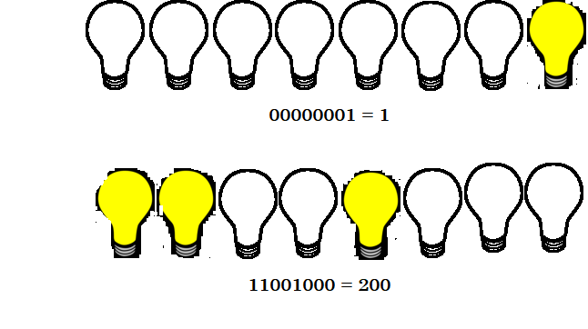
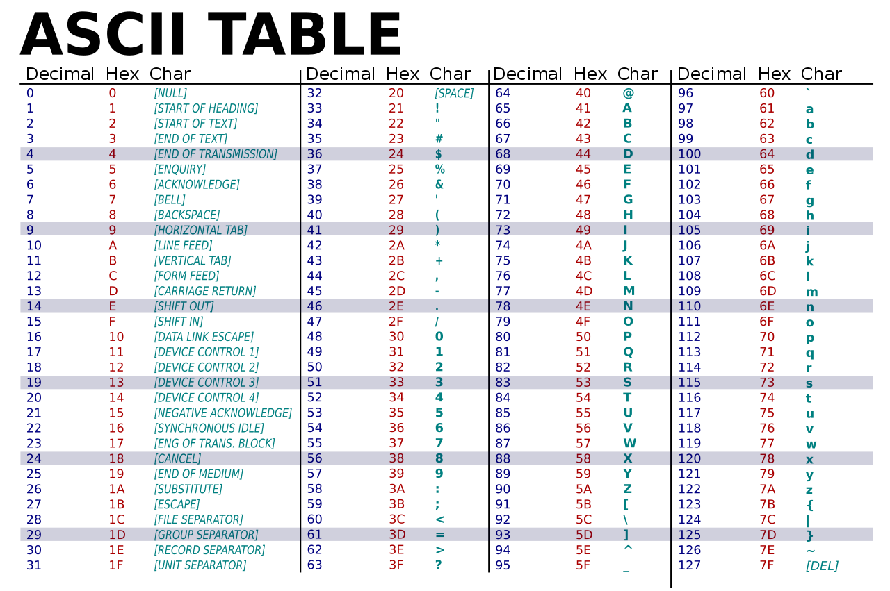
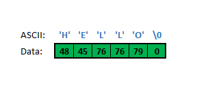

# Strings: What They Are

Strings, simply put, are a sequence of characters. Characters, in turn, are the symbols used in a natural language and they include letters, digits, punctuation as well as whitespace (regular spacing, indentations, returns, etc.).

In R, the term 'string' usually refers to a character vector of length 1.

## Low-level background (optional reading)

In the modern computer's random-access memory (RAM), where program instructions are carried out, there are tiny addressable units. By addresses, we mean the smallest part of memory that is identified with a number. It is in this portion that data is created. This addressable unit is known as a **byte**.

The unit of information in modern microcomputers is the **bit** (short for "binary digit") and represents two values - $1$ and $0$, and each byte essentially consists of 8 bits, also known as an *octet*. Each of these bits is like a minuscule light that is either turned `ON` or `OFF`. The machine understands numbers only at the binary level. The eight bits are, by convention, numbered `0` to `7` and with the least-significant bit (LSB) on the far right and the most-significant bit (MSB) on the left.



A character occupies 1 byte of data and this datum is created as a numerical value in base 2. Thus, for example the number $3$ in base 2 is $11$. At the level of a byte with 8 bits, this is represented as $00000011$. Using the analogy of the light bulbs, this means that out of the 8 bulbs, the 2 on the far left are on while the rest are all off. This evaluates to 3 in base 2.

Each character has a numerical value to which it corresponds. This is what is known as encoding--the internal representation of characters. In the  one of the common encoding systems used is the American Standard Code for Information Interchange (ASCII). The ASCII system caters for the language symbols in the English language only, and over time, more extended encoding systems have been developed and internationally accepted. The ASCII system, however is still very much relevant today.



From the table, we see that the decimal number `32` is mapped to the letter `A`. At the machine-level, this number is in the binary form i.e. `00010000` (bit ). So when we type in this letter as input this is what happens ultimately at the level of the processor. Then, contiguous portions of the memory, each with its own address, are then put together in an array to create a string. At the end of the string, the sequence is then closed of with a `NUL` character (`\0`). In high-level languages like R, we do not see this character at all, so we don't bother with it.



Although ASCII is considered the gold standard for character encoding, it is a legacy system. The default encoding for many of the text-related operations in R is **UTF-8**, which is part of the UNICODE standard as it allows for the use of characters outside the English lexicon. The work of the UNICODE Consortium has now broadened the consensus for language characters in use across the world, and some of these now allow for the use of more than one byte. ASCII system has only 127 characters, and the maximum number of possible characters that could fit into a single byte is $2^8 = `r 2^8`$. The coming of 2-byte capabilities now makes it possible to have a staggering $2^16 = `r 2^16`$ characters!


## Construction of strings

Making strings in R is simple and straightforward. Recalling that we have string literals, which are constants and identifiable by the R interpreter by quoting. All the operations that lead to the formation of the character sequence are carried out under the hood. However, to access the low-level values, one could use raw vectors (vectors whose elements are individual bytes)

```{r}
greet <- "HELLO"
bytes <- charToRaw(greet)
bytes
```

The output of the above code can be compared with the ASCII lookup table. Note that the values are in hexadecimal (base 16). In this system the digits run from 0 to F, where A-F are the equivalent of 10-15 in the decimal. Hexadecimals are very useful in representing bytes because `F` is equal to 4 bits and `FF` is the same as `11111111` (256) when all the bits are turned on. So it is an effective shorthand for representing what is happening at the level of bytes. This knowledge is not only handy when it comes to dealing with strings, but also when dealing with colours and images (i.e. pixels). R gives us several functions to work with these.

```{r}
as.integer(bytes)
```


For day-to-day data analysis, there is no need to worry about low-level string representations and in English-speaking locales, there is rarely the need to worry about encoding. The locale is normally set during installation, but can be modified with the appropriate functions during an R session. The locale represents the broad application settings that influence how the system interprets some of these data e.g. language, time zones, currency symbols, etc. To check the current locale,

```{r}
Sys.getlocale()
```

### Special characters

There are a few special characters that are used in R that are usually denoted with 'escapes'. Escaping is a concept where a character's meaning is no longer as-is, but altered by an adjunct character - in most modern languages this is the backslash (`\`) character. Escaping allows us to nest quotation marks when writing strings.

```{r}
cat("We use quotation marks create a \"string\".")
```

```{r}
cat("We use quotation marks\ncreate a \"string\".")
```

## Capacity

We can check the size of a string using the `nchar` function

```{r}
nchar(greet)
```

And it is equally vectorized

```{r}
greetings <- c(greet, "Hi", "Hey", "Whassuuup")
nchar(greetings)
```

### Some corner cases

The function `character()` creates a character vector. The first corner case is a character vector with no length and no quoted portions.

```{r}
character()
```

This simply means there is nothing there. However, using this function is sometimes useful when we can to make sure a function argument receives only character vectors as input.

```{r}
is.character(character())   # TRUE
length(character())
```

```{r, error=TRUE}
myfun <- function(x = character()) {
  stopifnot(is.character(x))
  "The input is a character vector"
}

myfun()
myfun(42)
myfun("What am I?")
```

# String Operations

## Concatenation

In R we can join 2 or more strings together using the `paste` and `paste0` functions (their defaults differ by how they handle spaces).

```{r}
paste("Hello", "World")
paste("The", "quick", "brown", "fox", "jumps")
paste0("CV.", "docx")
```

and they follow the rules of vectorization and recycling:

```{r}
oneTofive <- 1:5
AtoE <- LETTERS[oneTofive]

paste(AtoE, oneTofive)
paste0(AtoE, oneTofive)
(qno <- paste0("(Ques. ", oneTofive, ") =>"))
```

## Replacement

Say we already have a string (or a collection of strings as a character vector with length \> 1), there are ways that R allows us to make replace characters within a string For instance, to replace characters in a string, we can use the function `chartr`.

```{r}
chartr(old = "_", new = "-", "holiday_inn_at_sunset")
```

```{r}
chartr("pp", "ff", "wapple")
```

It also does replacement along the length of a vector:

```{r}
chartr("=", "-", qno)
```

## Checks

There are functions for checking prefixes and suffixes of strings - `startsWith` and `endsWith`.

```{r}
song <- "Title: \"Blame It On The Rain\""
startsWith(x = song, "Title")

vars <- names(iris)
startsWith(x = vars, prefix = "Petal")
```

## Extraction

A section of a string can be extracted using the `substr` and `substring` functions. The arguments are the string, the starting position and the ending as integers

```{r}
substr(song, 1, 5)
substr(song, 9, 13)
```

We can also use code to identify the starting and ending points, but that's the job of regular expressions (discussed below).

The assignment version of these functions can also be used to make text replacements. Note that this modifies the string in place i.e. we don't need to reassign its name.

```{r}
substr(song, 1, 5) <- "TITLE"
song
```

## Splitting

A string can be split into many pieces based on one (or a sequence) of its characters. Let say, for example we have a portion of text that has several sentences. We can create a collection of all the sentences, since a properly written sentence terminates with a period (`.`).

```{r}
txt <- "Today is Friday. Some say \"Thank God it's Friday\", and they may have good reasons for saying so. However, there are those who actually enjoy their work so much that they rue weekends."

strsplit(x = txt, split = '. ', fixed = TRUE)
```

We have used the `fixed` argument to avoid the interpretation of `split` as a regular expression.

# Regular expressions

In the preceding section, we had occasion to mention **regular expressions**. So, what are they? Regular expressions are a set of characters that are used to denote patterns in strings and these can be used to identify and modify them.

## How regex works

Let's look at the word "apple". It has 5 letters "a", "p", "p", "l" and "e". However it has only 4 patterns i.e. **kinds of characters** -- `a`, `p`, `l` and `e` since the letter "p" occurs twice. Thus, we use the pattern to ask a question like "Does the letter 'p' exist in the word 'apple'"? The answer of course is "Yes".

One of the key functions that uses regex in R is `grep`; by default it applies a pattern to a character vector and returns the index for the element that matches that pattern. So, using R code to ask the question above, with

```{r}
grep(pattern = 'p', x = 'apple')
```

we find that the vector `x` matches the pattern "p" at position `1L`. For clarity, we will add more elements to the input vector.

```{r}
chr <- c("triplet", "home", "turf", "holy", "apple", "clothes")
grep('p', chr)
```

The result says that the vector `chr` has 2 elements that contain the letter "p" at positions `1` and `5`.

`grep` has other arguments such as `value` and `ignore.case` to give additional capabilities.

```{r}
grep('p', chr, value = TRUE)
```

So, instead of the index, it is often more useful to know what exactly matches the pattern.

Regular expressions are case-sensitive, so `grep` gives us the option of overriding this

```{r}
# Match with a capital 'P'
grep('P', chr)
grep('P', chr, ignore.case = TRUE)
```

Then we have the variant of `grepl` that just checks and returns a logical result -- also extremely useful during analyses.

```{r}
grepl('p', chr)
```

### Meta-characters

We have already seen that all regular characters i.e. letters and digits (in ASCII mode) match themselves. In addition to these we have the meta-characters `. \ | ( ) [ { ^ $ * + ?` that singly or in combination have can have various meanings depending on how they are used.

#### Anchors

The characters `^` and `$` are used to represent the beginning or end of a string, respectively. Thus, using our vector `chr`we can check for all the strings that contain a 't' as follows

```{r}
grep('t', chr, value = T)
```

but if we want to check only strings that **start** with 't', we will use the `^` character as our anchor

```{r}
grep("^t", chr, value = T)
```

and if we add more characters, we can fine-tune the search

```{r}
grep('^tu', chr, value = T)
```

The strings "triple" and "turf" both have 't' and 'r' in them, but their order of use differs and regular expressions are strict when it comes to order

```{r}
grep('^tr', chr, value = TRUE)
```

The regex `^tr` is interpreted as "*a string that starts with a 't' followed by an 'r', both of which are lower-case letters*".

Use of the termination anchor `$` is similar

```{r}
grep("e", chr, value = TRUE)
grep("e$", chr, value = TRUE)
grep("me$", chr, value = TRUE)
```

#### Quantifiers

The meta-characters `* ? + {n} {n, } {n,m}` are used to state how many times a character is to be matched in sequence. This is how they are interpreted for any character `X`:

| Meta    | Matches                                 |
|---------|-----------------------------------------|
| `+`     | One or more times                       |
| `*`     | Zero or more times                      |
| `?`     | At most once i.e. it is optional        |
| `{n}`   | Exactly `n` times                       |
| `{n,}`  | At least `n` times                      |
| `{n,m}` | Between `n` and `m` times (inclusively) |

```{r}
chr2 <- c(chr, "plain", "ball", "Boil", "people")
chr2
```

```{r}
grep("p", chr2, value = T)
grep("pp", chr2, value = T)
grep("p{2,}", chr2, value = T)
```

### Character classes

The regex engine provides for the use of character classes, which are constructs that broadly define certain groupings of characters. So, instead of doing this

```{r}
numbers <- c("zero", "1" , "2", "three", "Four", "FIVE")
grep("[0-9]", numbers, value = TRUE)
grep("[a-z]", numbers, value = T)
grep("[A-Z]", numbers, value = T)
grep("[[:alpha:]]", numbers, value = TRUE)
grep("[[:digit:]]", numbers, value = T)
grep("[[:alnum:]]", numbers, value = T)
```

### Back-references

We can use parentheses to demarcate part of a string and then use back-references as placeholders to refer to those portions of the string.

```{r}
sub(pattern = "s(ho)r(t)", replacement = "\\1\\2", "A short sentence")
```
