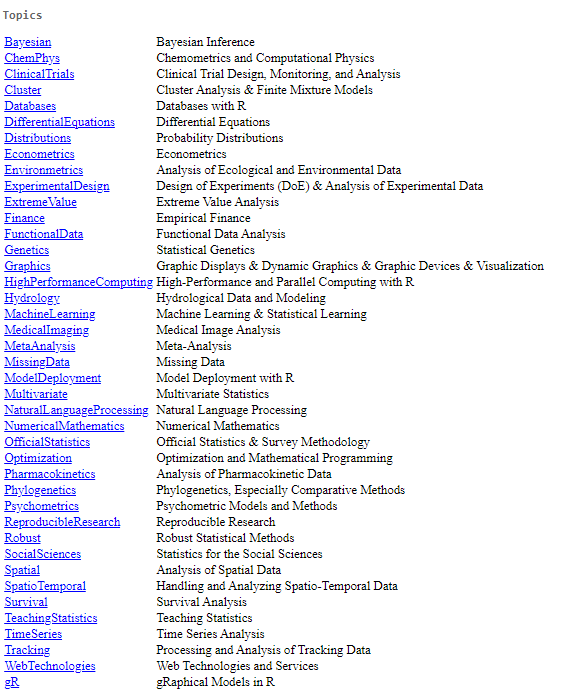
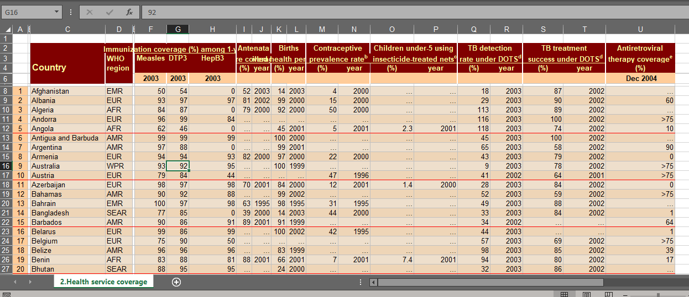
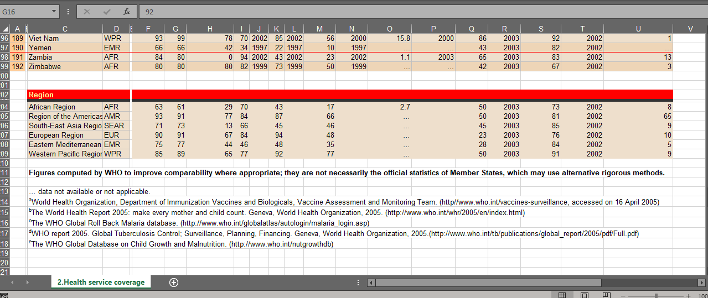
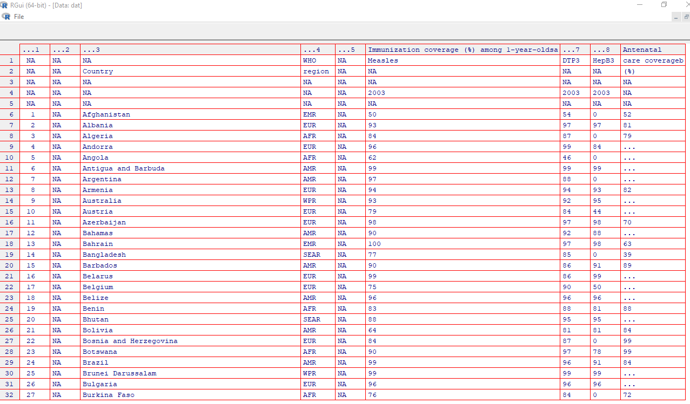

```{r setup, include=FALSE}
knitr::opts_chunk$set(echo = TRUE)
```

## Recap
>- Invocation and the Read-Eval-Print Loop
>- Constants
>- Parsing of R code
>- Strings and names
>- Functions and operators
>- Comments
>- Working directory
>- Workspace
>- Search path
>- Documentation

## 3rd-Party Libraries (Packages)
>- Compilation of functions and/or data
>- Made to ease specific (repetitive) tasks
>- Some are general-purpose, others domain-specific
>- Currently, 17678 packages on CRAN
>- Other locations - Bioconductor, GitHub
>- See [CRAN Task Views](https://cran.r-project.org/views)

---
<center>

</center>

---

A hypothetical package called **pkg** has a function, `pause()`:

>- To install from CRAN - `install.packages("pkg")`
>- To learn about the package - `help(package = "pkg")`
>- To use `pkg` in R session - `library(pkg)` (or `require`)
>- Function `pause()` can be used one-off - `pkg::pause()`
>- To detach `pkg` from search path - `detach("package:pkg")`
>- To uninstall `pkg` use `remove.packages("pkg")`

## Importing Data
>- Note: There are inbuilt datasets
>- Import from MS Excel using the *readxl* package
>- This object is called a data frame
>- Has observations (rows) and variables (columns)

---

```{r, message=FALSE}
dat <- readxl::read_excel("whostat2005_coverage.xls")

# Alternatively:
# library(readxl)
# dat <- read_excel("whostat2005_coverage.xls")
```

---

{width="100%"}

---

{width="100%"}

## Data exploration
- `View()` (to find out about it - `?View`)

{width="100%"}

## Data exploration
>- `dim()`
>- `head()` or `tail()`
>- `colnames()`
>- `str()`

---

```{r untibble, include=FALSE}
dat <- as.data.frame(dat)
```

```{r}
dim(dat)
```

---

```{r}
head(dat)
```

---

```{r}
tail(dat)
```

---

```{r}
colnames(dat)
```

---

```{r}
str(dat)
```


## Subsetting
- `$` operator allows us to pick out a column by name
- A new object can be created from the column
- The column can also be modified with this operator
- Concept of getting and setting

```{r}
# Get
anc <- dat$Antenatal
```

---

To see value of object bound to `anc`, run the name alone

```{r}
anc
```

---

Hmmm, it's rather long. Let's shorten the output a little.

```{r}
head(anc)
```
```{r}
tail(anc)
```

---

- These objects we have extracted from our data frame are known as **atomic vectors**.
- `[]` and `[[]]` also allow sub-setting with numerical indices
- Getting/setting applies

```{r}
anc2 <- dat[['Antenatal']]
anc3 <- dat[[9]]
```

```{r, results='hold'}
identical(anc, anc2)
identical(anc, anc3)
```


## Data Cleaning

>- Time-consuming
>- Development of elegant constructs
>- R scripts allow documentation of cleaning data steps
>- Scripting: quality assurance, knowledge sharing and correction/reversal where necessary
>- Scripting  ->  package development  ->  Automation
>- 3rd party packages available (limited value)

# Attempt to improve data import (DEMO)

## Simple summary statistics
- `summary()`
- For categorical data - `table()`
- For numerical data - `fivenum()`

## Visualization
>- Outstanding graphics capabilities
>- Base R, other packages like **lattice** and **ggplot2**
>- Run `demo("graphics")` and `demo("image")`


## Concluding your Session
>- You will be prompted to save your session.
>- 99% of the time DON'T do this!
>- Rather than saving objects, save the scripts that created them.
>- You can save individual objects with the function `saveRDS()`
>- To recall the object, used `readRDS()`.

---

```{r}
# Create a variable with the filename. Why?
myfile <- "who_data.rds"

# Save the object on disk
saveRDS(dat, file = myfile)

# Read the object from disk
diskdat <- readRDS(file = myfile)

# Check if it's the same as the earlier object
identical(dat, diskdat)
```

```{r rm, include=FALSE}
file.remove(myfile)
```

## Resources
- Quick R - <https://www.statmethods.net/>

## TO DO
1. Install R, R Studio and Rtools.
2. Open accounts individually with <https://github.com>.
3. Open corporate account for HSCL (Coordinator)
4. Pick any old Excel file and import it into R. Give it the name `mydat`:
  - You may have to install the **readxl** package.
  - What is the result of `nrow(mydat)`?
  - what is the result of `ncol(mydat)`?
  - Run `lapply(mydat, typeof)` and inspect the result. What do you think happened? (Tip: You are free to check `?typeof` and `?lapply`, or even Google!)
